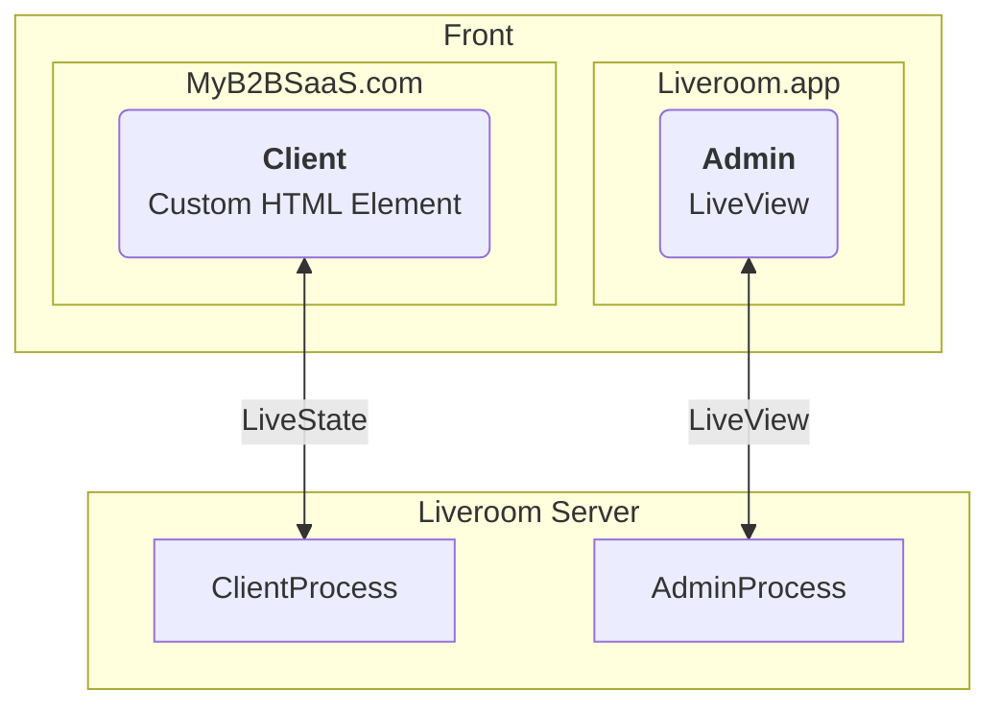

<p align="center">
  <a href="https://liveroom.app">
    
  </a>
</p>

<p align="center">
  <a href="https://liveroom.app">liveroom.app</a>
</p>

<p align="center">
  <a href="https://github.com/liveroom-app/liveroom/actions/workflows/CI.yml?query=branch%3Amain" class="m-1 d-inline-block"></a>
  <!-- <a href="https://www.jsdelivr.com/package/npm/liveroom" class="m-1 d-inline-block"></a> -->
  <a href="https://github.com/liveroom-app/liveroom/issues" class="m-1 d-inline-block"></a>
  <a href="https://github.com/liveroom-app/liveroom" class="m-1 d-inline-block"></a>
</p>

# Liveroom

Liveroom allows you to collaborate with your users, right inside your product.

## Disclaimer

Liveroom is currently very early stage. We are exploring technical feasibility, and trying different ideas to find what could be a good first version of Liveroom.

If you are interested in beta testing the product once it is ready, please [join the waitlist](https://tally.so/r/wQ1EvX).

## Demo

### on [liveroom.app](https://liveroom.app)

The landing page has an interactive dashboard to play with. Open 2 browser windows to see the collaborative features in real-time.

### on any website

1. run the following code in the browser console to install the **Liveroom Client**:

```js
const script = document.createElement("script");
script.type = "module";
script.src =
  "https://cdn.jsdelivr.net/npm/liveroom-client-element@0.0.2/dist/liveroom-client-element.es.min.js";
script.onload = function () {
  const liveroomElement = document.createElement("liveroom-client-element");
  liveroomElement.setAttribute("url", "wss://liveroom.app/client_socket");
  liveroomElement.setAttribute("room_id", "public");
  document.body.appendChild(liveroomElement);
};
document.head.appendChild(script);
```

2. open https://liveroom.app/room/public/admin in a second browser window.

## Context

> this is a work in progress

For simplicity, let's consider that Liveroom is being used to showcase a B2B SaaS product called _MyB2BSaaS_.

There are 2 main personas in Liveroom:

- **admin**: this is the builder of the product, who wants to show a demo of his product to his client.

- **client**: this is the potential customer of the product.

Those 2 personas have access to 2 different experiences in Liveroom:

- The admin has an interface showing all the connected clients in the room. They are displayed on different screens, to respect aspect ratio. He can interact with each of them. This interface is hosted on [Liveroom](https://liveroom.app).

- The client has a minimal Liveroom interface, on top of the interface of _MyB2BSaaS_. The Liveroom interface is embedded as much as possible, for example just a little pill on the bottom of the screen.

## Architecture

> this is a work in progress



**ClientProcess** & **AdminProcess** communicate with each other over PubSub (can't draw it properly on the Mermaid graph), on a particular **room** (topic).

The HTML Custom Element allows Liveroom to be plug-and-play on any SaaS product easily.

## Setup

1. install dependencies: `mix setup`
2. start app: `iex -S mix phx.server`

Now you can visit [`localhost:4000`](http://localhost:4000) from your browser.
